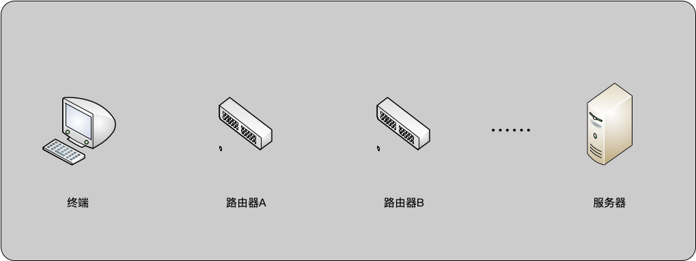
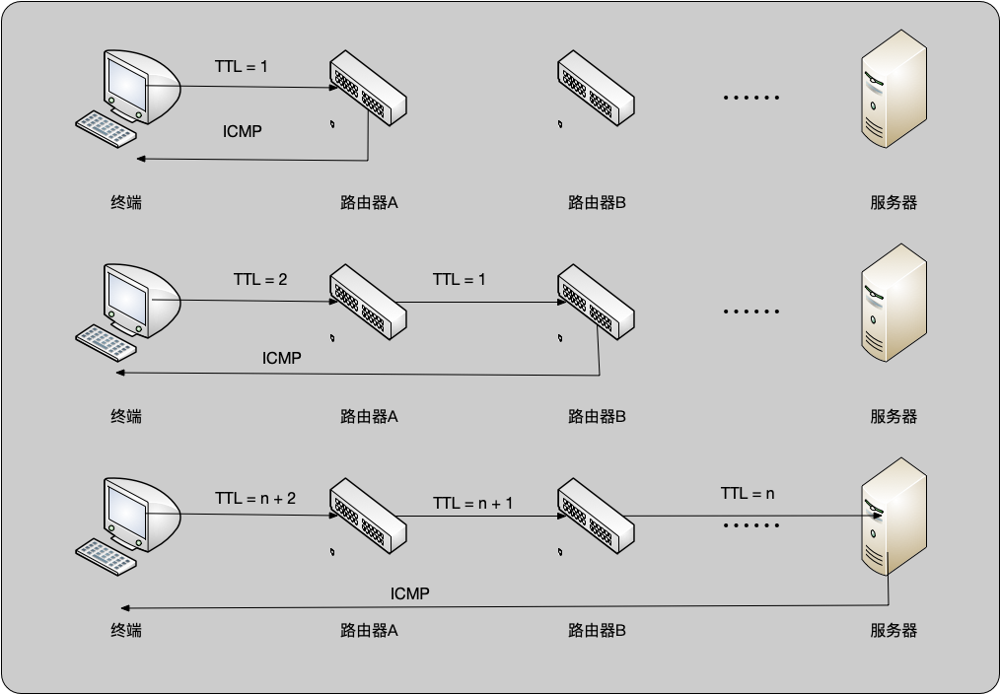
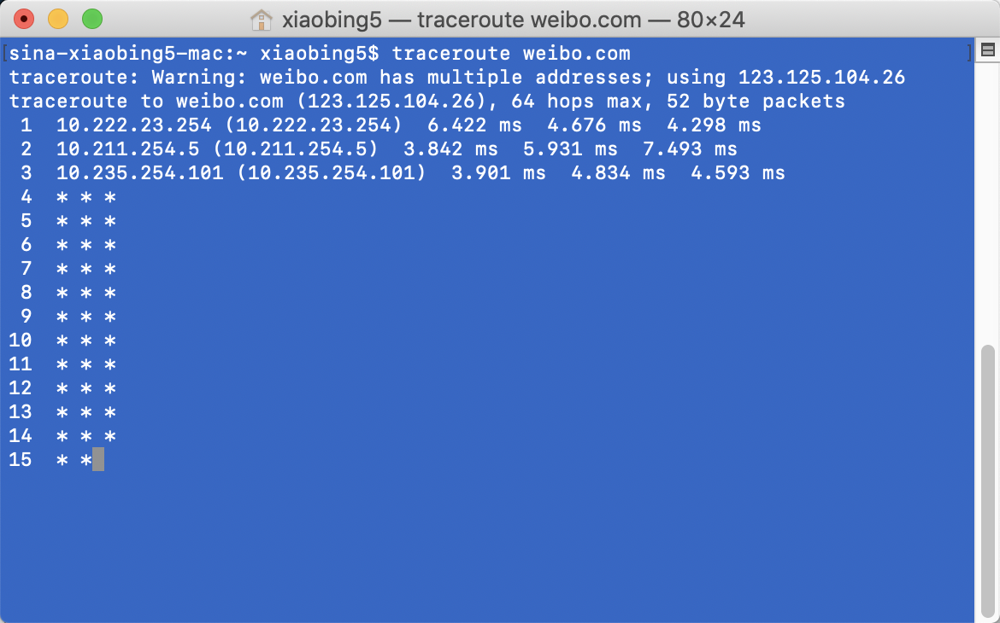
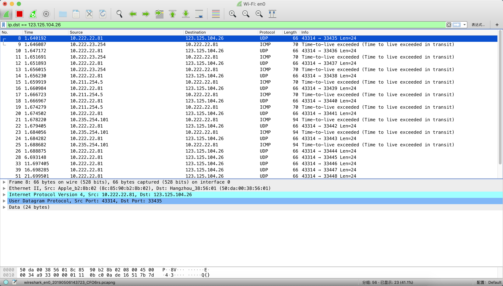
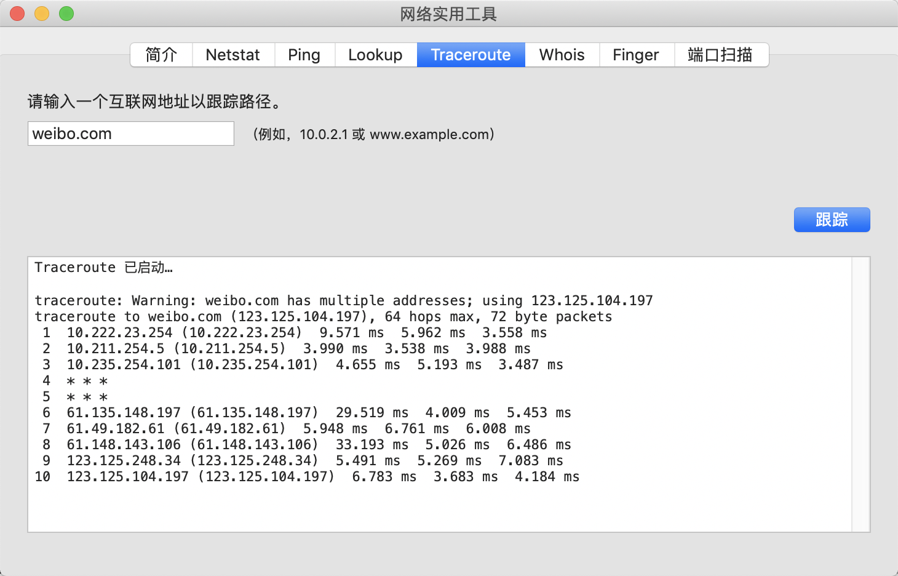
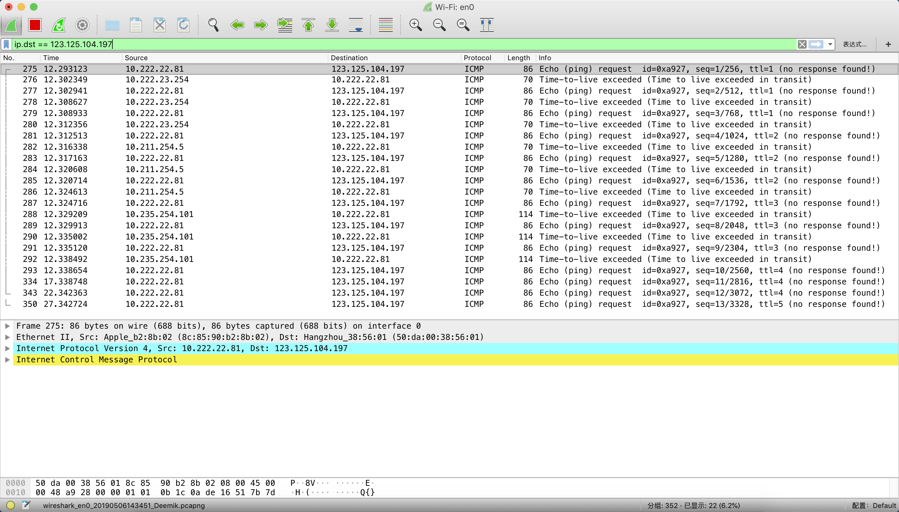

#路由诊断
###网络拓扑图
<center>
	
</center>


###路由诊断原理
<center>
	
</center>

>“Traceroute程序发送一份UDP数据报给目的主机，但它选择一个不可能的值作为UDP端口
号（大于30 000），使目的主机的任何一个应用程序都不可能使用该端口。因为，当该数据报
到达时，将使目的主机的UDP模块产生一份“端口不可达”错误的ICMP报文。
这样，Traceroute程序所要做的就是区分接收到的ICMP报文是超时还是端口不可达，以判断
什么时候结束。”
中间的路由器是因为TTL=0以后返回ICMP 类型11，代码0的超时消息。
目的IP到了以后，拆包分析UDP内容，发现端口不可达，返回ICMP类型3，代码3（目标端口不可达）实现。
在windws主机里面的tracert和TCP/IP详解的表述有点出入。windows主机的tracert是直接是用ping来实现的，但是这个ping的TTL值在3个包后增大1，不可达或者超时后返回星号，继续下一个TTL的包的发送，一直到达默认设置的30跳。一般在路由器和交换机上的traceroute都是UDP的方式，每个TTL发的包的个数和最大跳数、UDP开始端口都是可以调整的。<br>
>路由诊断的目的是为了知道从终端到服务器的链路个各个节点的信息

###路由诊断示例
>下边是一个网络诊断的信息（使用的是MAC自带的 网络实用工具）

```c
traceroute: Warning: weibo.com has multiple addresses; using 123.125.104.197
traceroute to weibo.com (123.125.104.197), 64 hops max, 72 byte packets
 1  10.222.23.254 (10.222.23.254)  9.571 ms  5.962 ms  3.558 ms
 2  10.211.254.5 (10.211.254.5)  3.990 ms  3.538 ms  3.988 ms
 3  10.235.254.101 (10.235.254.101)  4.655 ms  5.193 ms  3.487 ms
 4  * * *
 5  * * *
 6  61.135.148.197 (61.135.148.197)  29.519 ms  4.009 ms  5.453 ms
 7  61.49.182.61 (61.49.182.61)  5.948 ms  6.761 ms  6.008 ms
 8  61.148.143.106 (61.148.143.106)  33.193 ms  5.026 ms  6.486 ms
 9  123.125.248.34 (123.125.248.34)  5.491 ms  5.269 ms  7.083 ms
10  123.125.104.197 (123.125.104.197)  6.783 ms  3.683 ms  4.184 ms
```

###路由诊断实现方案
>路由诊断有两种实现方案,一种是居于UDP方案实现的，一种是基于ICMP（Internet Control Message Protocol）实现的。

###一、基于UDP包
<center>
	
</center>

<center>
	
</center>


>参考效果，mac命令 `traceroute 192.168.31.183`<br>
>参考第三方库 [LDNetDiagnoService](https://github.com/Lede-Inc/LDNetDiagnoService_IOS).

缺点：因为安全问题大部分的应用服务器都不提供UDP服务（或者被防火墙挡掉），所以我们拿不到服务器的任何返回，程序就理所当然的认为还没有结束，一直尝试增加数据包的TTL,实际用起来并不能达到想要的效果.

###二、基于ICMP协议
<center>
	
</center>
<center>
	
</center>

>参考效果 （网络实用工具）

>

###三参考资料
> [ipv4-ipv6header介绍](https://www.cisco.com/en/US/technologies/tk648/tk872/technologies_white_paper0900aecd8054d37d.html)<br>
> [ICMP6简介](https://en.wikipedia.org/wiki/Internet_Control_Message_Protocol_for_IPv6)<br>
> [ICMP文档](https://tools.ietf.org/html/rfc2463)<br>
> [LDNetDiagnoService](https://github.com/Lede-Inc/LDNetDiagnoService_IOS).


 
###四、文档中实用的命令的命令
```c
traceroute weibo.com
```

```c
ip.dst == 123.125.29.208
```